<div align="center">

# Logmask-Drain


**Use the model once. Parse locally forever.**

CPU-first log parsing with offline regex mask bundles, strict local validation,
and deterministic Drain-style template extraction.

<p>
  <a href="https://github.com/Taz33m/Logmask-Drain/actions/workflows/ci.yml">
    
  </a>
  
  
  
  
  
  
  
</p>

<p>
  <a href="https://youtu.be/2YwAi0M_Jps"><b>Watch Demo</b></a>
  ·
  <a href="https://arxiv.org/abs/2604.20553"><b>DeepParse Paper</b></a>
  ·
  <a href="docs/BENCHMARK_MATRIX.md"><b>Benchmark Matrix</b></a>
  ·
  <a href="docs/PRD.md"><b>PRD</b></a>
  ·
  <a href="docs/ROADMAP.md"><b>Roadmap</b></a>
</p>

<p>
  <a href="https://youtu.be/2YwAi0M_Jps">Professional demo video on YouTube</a>
</p>

</div>

## What It Is

Logmask-Drain is an architecture-first implementation of the core idea behind
**DeepParse: Hybrid Log Parsing with LLM-Synthesized Regex Masks**
([arXiv:2604.20553](https://arxiv.org/abs/2604.20553)):

1. sample representative log lines,
2. synthesize or load reusable regex masks offline,
3. validate every mask locally,
4. cache the accepted mask bundle,
5. parse future logs deterministically with mask-first Drain-style execution.

The default workflow is intentionally boring in the best way: no GPU, no model
download, no API key, and no network access at runtime.

## What It Is Not

This repository is **not** the DeepParse authors' official artifact. It does
not ship a fine-tuned DeepSeek-R1 checkpoint, reproduce the paper's full
LogHub-scale benchmark, or include the LogBERT downstream anomaly-detection
case study. Logmask-Drain focuses on the practical, auditable product boundary:

> fixed masks in, deterministic templates out.

## Why It Matters

Raw log parsers often split one event into many templates because IDs, IPs,
paths, hashes, request IDs, or timestamps look like structure. Per-line LLM
parsing can recover intent, but it is expensive, non-deterministic, and awkward
for private operational logs.

Logmask-Drain takes the middle path:

- use rules or an optional LLM once to propose masks,
- reject unsafe or over-broad regexes before they can run,
- preserve static context such as `request_id=`,
- replace only values with typed placeholders,
- parse locally forever from a saved bundle.

## Installation

From a local checkout:

```bash
python -m pip install -e ".[dev]"
```

From GitHub:

```bash
python -m pip install "git+https://github.com/Taz33m/Logmask-Drain.git"
```

Optional extras:

```bash
python -m pip install ".[api-llm]"   # OpenAI API candidate-mask synthesis
python -m pip install ".[drain3]"    # optional Drain3 parser adapter
python -m pip install ".[yaml]"      # YAML mask-bundle loading
```

## Quickstart

Create a conservative mask bundle from sample logs:

```bash
logmask synthesize sample.txt \
  --backend rules \
  --rule-mode conservative \
  --out masks.json
```

Validate the bundle before it is trusted:

```bash
logmask validate-masks masks.json \
  --logs sample.txt \
  --strict
```

Mask and parse logs deterministically:

```bash
logmask mask logs.txt \
  --masks masks.json \
  --out masked.jsonl

logmask parse logs.txt \
  --masks masks.json \
  --template-id-mode hash \
  --out parsed.jsonl
```

Inspect the result:

```bash
logmask report parsed.jsonl
logmask inspect parsed.jsonl
```

## Architecture

```mermaid
flowchart LR
  A["Raw logs"] --> B["Sample<br/>entropy-greedy / random / longest"]
  B --> C["Offline synthesis<br/>rules / API LLM / local llama.cpp"]
  C --> D["Candidate masks"]
  D --> E["Strict local validation<br/>syntax, timeouts, broadness, overlaps"]
  E --> F["Saved mask bundle<br/>runtime_mask_sha256"]
  F --> G["Mask-first execution<br/>typed placeholders + spans"]
  G --> H["simple_drain or drain3"]
  H --> I["Deterministic JSONL<br/>template_hash + parser metadata"]
  I --> J["Reports, drift, benchmarks"]
```



The LLM path never produces trusted runtime configuration directly. It produces
candidate masks. The local validator decides what survives.

## Mask Bundle Contract

Mask bundles are the reproducible boundary between offline synthesis and online
parsing. Runtime-relevant fields are canonically hashed as
`runtime_mask_sha256`, so parsing output can be audited and compared across
machines.

```json
{
  "name": "request_id_assignment",
  "type": "REQUEST_ID",
  "pattern": "\\brequest[_-]?id=([A-Za-z0-9_.:-]+)\\b",
  "value_group": 1,
  "replacement": "<VAR:REQUEST_ID>",
  "priority": 80,
  "enabled": true,
  "flags": ["IGNORECASE"]
}
```

With `value_group`, Logmask-Drain preserves the key and masks only the value:

```text
request_id=abc123  ->  request_id=<VAR:REQUEST_ID>
```

## Safety Boundary

Strict validation rejects masks that are unsafe, broken, empty, too broad, or
semantically harmful for log parsing. This includes:

- unsupported regex flags,
- invalid `value_group` references,
- empty selected spans,
- catastrophic-looking regex structures,
- over-broad full-line captures,
- masks that hide log levels by default,
- duplicate match-equivalent masks,
- placeholder/type mismatches,
- excessive sample character coverage.

Validation examples are redacted by default. Raw examples require explicit
opt-in.

## Optional API LLM Synthesis

API synthesis is opt-in. The default rules backend remains network-free.

```bash
python -m pip install ".[api-llm]"

logmask synthesize sample.txt \
  --backend api-llm \
  --provider openai \
  --model gpt-4.1-mini \
  --max-api-sample-lines 100 \
  --max-api-sample-chars 50000 \
  --candidate-report candidates.json \
  --out masks.llm.json
```

Oversized API samples are rejected by default to avoid accidentally sending a
large production log file to a provider. Use `logmask sample` first, or pass
`--allow-large-api-sample` only after reviewing the data.

Hybrid mode is explicit:

```bash
logmask synthesize sample.txt \
  --backend api-llm \
  --provider openai \
  --model gpt-4.1-mini \
  --base-rules conservative \
  --out masks.hybrid.json
```

## Optional Local LLM Synthesis

Local synthesis uses an external `llama-cli` executable from llama.cpp. It is
still candidate-only and still passes through strict local validation.

```bash
logmask synthesize sample.txt \
  --backend local-llm \
  --local-provider llama-cpp \
  --llama-cli llama-cli \
  --model-path ./models/mask-synth.gguf \
  --candidate-report local-candidates.json \
  --out masks.local.json
```

## Parser Engines

`simple_drain` is the default parser engine. It is deterministic and has no
optional dependencies.

```bash
logmask parse logs.txt \
  --masks masks.json \
  --engine simple_drain \
  --template-id-mode hash \
  --out parsed.jsonl
```

Drain3 is optional:

```bash
python -m pip install ".[drain3]"

logmask parse logs.txt \
  --masks masks.json \
  --engine drain3 \
  --template-id-mode hash \
  --out parsed.drain3.jsonl
```

Template strings and hashes may differ by engine. Parsed JSONL records parser
metadata so results remain auditable.

## Benchmarking

Toy benchmark:

```bash
logmask benchmark \
  --logs tests/fixtures/toy/logs.txt \
  --ground-truth tests/fixtures/toy/templates.csv \
  --methods drain,builtin
```

Benchmark matrix:

```bash
logmask benchmark-matrix \
  --logs logs.txt \
  --ground-truth templates.csv \
  --methods simple_raw,builtin_simple,bundle_simple \
  --masks masks.json \
  --out matrix-results.json
```

LogHub-style structured CSV benchmark:

```bash
logmask benchmark-loghub-matrix \
  --structured HDFS_2k.log_structured.csv \
  --methods simple_raw,builtin_simple,drain3_raw,builtin_drain3 \
  --label-source "LogHub-2k structured CSV EventTemplate/EventId" \
  --out loghub-matrix.json
```

Logmask-Drain does not bundle LogHub data and does not make paper-scale
accuracy claims. The benchmark layer exists to make parser/template behavior
inspectable and reproducible.

Reported metrics include:

- `GA_exact`
- `PA_generic`
- nullable `PA_typed`
- template count
- singleton rate
- parse runtime and total runtime
- mask coverage
- accepted and rejected mask counts

## CLI Reference

| Command | Purpose |
| --- | --- |
| `logmask sample` | Select representative lines for offline synthesis. |
| `logmask synthesize` | Create mask bundles with rules, API LLM, or local LLM backends. |
| `logmask validate-masks` | Validate a mask bundle against sample logs. |
| `logmask mask` | Apply a bundle and emit masked JSONL with spans. |
| `logmask parse` | Mask first, then parse with `simple_drain` or `drain3`. |
| `logmask report` | Summarize templates, variables, coverage, and recommendations. |
| `logmask inspect` | Inspect parsed JSONL interactively in the terminal. |
| `logmask drift` | Compare parsed outputs for operational drift. |
| `logmask diff-masks` | Compare mask bundles. |
| `logmask benchmark-matrix` | Run structured reproducibility benchmarks. |
| `logmask benchmark-loghub-matrix` | Run LogHub-style matrix benchmarks from structured CSV labels. |

## Documentation

| Document | Description |
| --- | --- |
| [Product Requirements](docs/PRD.md) | Scope, non-goals, and release philosophy. |
| [Benchmark Matrix](docs/BENCHMARK_MATRIX.md) | Reproducibility benchmark schema and method IDs. |
| [LogHub Benchmarks](docs/LOGHUB_BENCHMARKS.md) | LogHub-style CSV contract and credibility notes. |
| [Local LLM](docs/LOCAL_LLM.md) | llama.cpp synthesis workflow. |
| [Mask Tuning](docs/MASK_TUNING.md) | Operational mask tuning guidance. |
| [Engineering Review](docs/REVIEW.md) | Current review notes and risks. |
| [Roadmap](docs/ROADMAP.md) | Planned milestones. |
| [PyPI Checklist](docs/PYPI_RELEASE_CHECKLIST.md) | Release checklist. |
| [Security Policy](SECURITY.md) | Supported versions, sensitive artifacts, and reporting guidance. |

## Development

```bash
python -m pip install -e ".[dev]" build twine
python -m pytest -q
python -m build
python -m twine check dist/*
```

Live provider tests are opt-in:

```bash
LOGMASK_RUN_LIVE_LLM_TESTS=1 python -m pytest tests/test_live_api_llm.py -q
LOGMASK_RUN_LIVE_LOCAL_LLM_TESTS=1 python -m pytest tests/test_live_local_llm.py -q
```

## License

MIT. See [LICENSE](LICENSE).

## Citation And Attribution

Logmask-Drain is inspired by the DeepParse paper's offline synthesis /
deterministic execution split:

```bibtex
@misc{deepparse2026,
  title         = {DeepParse: Hybrid Log Parsing with LLM-Synthesized Regex Masks},
  year          = {2026},
  eprint        = {2604.20553},
  archivePrefix = {arXiv}
}
```

Please cite the paper for the research idea and this repository for this
implementation.
